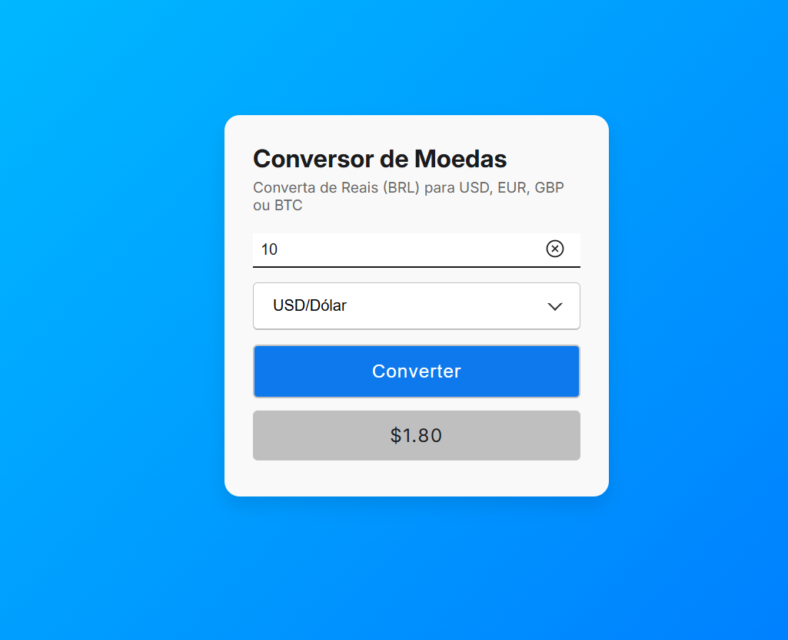

# 💱 Conversor de Moedas

Um aplicativo web simples e moderno para conversão de valores em Reais (BRL) para outras moedas populares: **Dólar (USD)**, **Euro (EUR)**, **Libra Esterlina (GBP)** e **Bitcoin (BTC)**.

 

## 🚀 Funcionalidades

- ✅ Conversão em tempo real de BRL para USD, EUR, GBP e BTC
- ✅ Campo de entrada com validação e mensagens de erro
- ✅ Dropdown customizado para seleção de moeda
- ✅ Alertas amigáveis com SweetAlert2
- ✅ Interface moderna com Google Fonts e Ionicons
- ✅ Cache simples para evitar múltiplas requisições em pouco tempo

## 🛠️ Tecnologias Utilizadas

- HTML5, CSS3, JavaScript (ES6+)
- [Google Fonts - Inter](https://fonts.google.com/specimen/Inter)
- [Ionicons](https://ionic.io/ionicons)
- [SweetAlert2](https://sweetalert2.github.io/)
- [AwesomeAPI - API de câmbio](https://docs.awesomeapi.com.br/)

## 📁 Estrutura de Pastas

```
  📦 conversor-de-moedas/
    ├── assets/
    │   └── screenshot.png
    ├── css/
    │   └── style.css
    ├── js/
    │   └── script.js
    └── index.html
```
## 📋 Como Usar

 1. Clone este repositório:
```bash
    git clone https://github.com/seu-usuario/conversor-de-moedas.git

```
2. Acesse o diretório do projeto:

 ```bash
    cd conversor-de-moedas
```
3. Abra o arquivo index.html no navegador:

- Você pode clicar duas vezes nele, ou
- Usar uma extensão como Live Server no VS Code

## ⚙️ Configuração da API de Câmbio

Para obter as cotações atualizadas, este projeto utiliza a API pública da AwesomeAPI.

### Obtendo seu Token

- Cadastre-se no site da AwesomeAPI para receber seu token de acesso (API key).
- O token é necessário para realizar as requisições de cotação.

### Inserindo o Token no Projeto

No arquivo js/script.js, localize a linha:

```bash
   const API_TOKEN = 'SEU_TOKEN_AQUI';
```
Substitua 'SEU_TOKEN_AQUI' pelo seu token pessoal,pois este é apenas uma chave temporária:

```bash
   const API_TOKEN = '*******************************';
```

### Importante

- O  aplicativo realiza cache das cotações por 5 minutos para reduzir o número de requisições e melhorar a performance.
- Se a API estiver indisponível ou ocorrer algum erro, valores padrão serão utilizados para que a conversão continue funcionando.
- Verifique se seu token está ativo e válido para garantir o correto funcionamento do conversor.

## 🤝 Contribuindo

Contribuições são bem-vindas! Sinta-se à vontade para abrir issues, sugerir melhorias ou enviar pull requests.